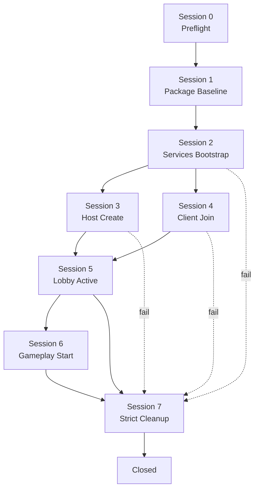
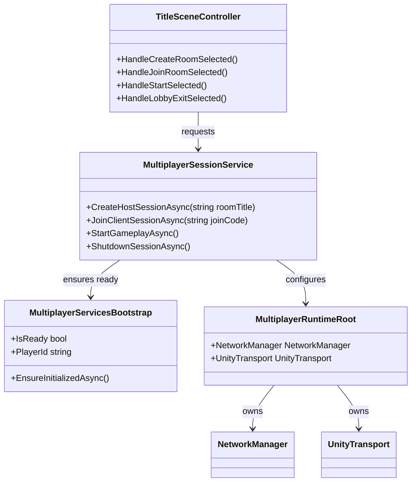
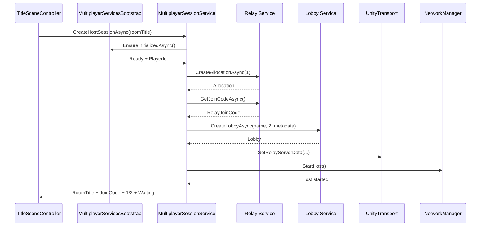
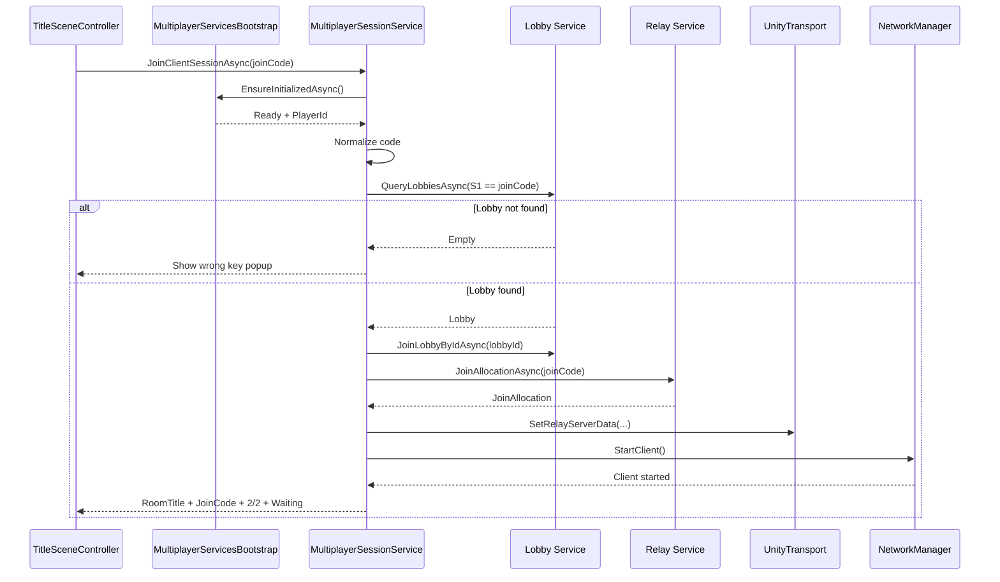

# 🧩 멀티플레이 초기화 세션 명세: Boss Raid Portfolio

이 문서는 `NGO / UTP / Relay / Lobby` 패키지 및 서비스 초기화를 **세션 단위**로 정확하게 정의한다.  
기존 `docs/technical/multiplayer/Multiplayer_Service_Initialization.md`가 넓은 기준 문서라면, 이 문서는 **"각 세션이 정확히 언제 시작되고, 무엇을 하고, 어디서 끝나는가"**를 더 또렷하게 설명하는 companion spec이다.

---

## 1. 문서 목적 (Purpose)

이 문서는 아래 항목을 세션 기준으로 고정한다.

* package 준비 세션
* UGS bootstrap 세션
* Host create 세션
* Client join 세션
* Lobby active 세션
* gameplay start 세션
* strict cleanup 세션

쉬운 설명:

이 문서는 각 멀티플레이 세션이 무엇을 하는지,  
언제 시작하는지,  
어떤 순서를 따르는지,  
어떻게 끝나는지를 설명한다.

---

## 2. 기준 문서와 참조 로그 (Reference)

| 항목 | 문서 |
| --- | --- |
| 상위 설계 문서 | `docs/technical/multiplayer/Multiplayer_Design.md` |
| UI 기준 문서 | `docs/technical/multiplayer/Multiplayer_UI_Flow.md` |
| 시스템 구조 기준 | `docs/technical/System_Blueprint.md` |
| 참조 로그 | `docs/Progress_Log/2026-03-16.md` |

### 2.1. 현재 기준선 (Current Baseline)

현재 저장소 기준선은 아래와 같다.

* common `TitleSceneController` 내부에는 아직 fake multiplayer prototype 메서드가 남아 있지만, duplicated multiplayer title scene의 Host create / Client join path는 real session service로 우회됐다.
* Host path는 real Relay join code, real Lobby metadata(`S1`), real `1/2 connected` 표시까지 연결됐다.
* Client path도 real Lobby query(`S1`) + Relay join + NGO Client start까지 연결됐고, `2/2 connected` 이후 `Start unlock` rule만 아직 후속 단계다.
* `Packages/manifest.json` direct baseline에는 `com.unity.services.multiplayer@2.1.3`, `com.unity.netcode.gameobjects@1.15.1`가 들어가 있다.
* `Packages/packages-lock.json`에는 resolver 결과로 `com.unity.transport@2.6.0`, `com.unity.services.authentication@3.6.0`, `com.unity.services.core@1.16.0` 등이 잡혀 있다.
* `ProjectSettings/ProjectSettings.asset`의 `cloudProjectId`는 채워져 있다.
* `Assets/Scripts/Multiplayer` 계층이 생겼고, 현재 `Bootstrap / Runtime / Services / UI / SceneFlow`로 분리돼 있다.

### 2.2. 현재 완료 상태 (Current Completion State)

`2026-03-17` 기준 현재 완료 상태는 아래와 같다.

| 항목 | 현재 상태 |
| --- | --- |
| Project Link | 완료 (`cloudProjectId` 채워짐) |
| Session 1 | 완료 |
| direct package | `com.unity.services.multiplayer@2.1.3` |
| direct package | `com.unity.netcode.gameobjects@1.15.1` |
| resolver package | `com.unity.transport@2.6.0` |
| resolver package | `com.unity.services.authentication@3.6.0` |
| resolver package | `com.unity.services.core@1.16.0` |
| resolve log | `Logs/unity_package_resolve.log` 생성 및 성공 |
| compile gate | `error CS`, `Compilation failed`, `Scripts have compiler errors` 패턴 미검출 |
| Session 2 code | `MultiplayerServicesBootstrap`, `MultiplayerTitleSceneDriver`, `MultiplayerScenePaths` 추가 |
| Session 2 scene scope | `Assets/Scenes/mutiplayer/TitleScene.unity`에서만 bootstrap path 활성 |
| Session 2 runtime smoke | 완료 (`Create Room` 클릭 전 `Connecting...` 확인 + Console `PlayerId` log 확인) |
| Session 3 code | `MultiplayerRuntimeRoot`, `MultiplayerSessionService`, `TitleSceneController` multiplayer bridge 추가 |
| Session 3 compile gate | 완료 (`dotnet build Assembly-CSharp.csproj -v:minimal`) |
| Session 3 current output | Host `Create Room` 성공 시 real Relay join code + Lobby create + `LobbyPanel` real `1/2 connected` |
| Session 3 runtime smoke | 완료 (`PlayerId ready -> Host session started -> Lobby heartbeat -> Deleting lobby -> Cleanup complete` 로그 확인) |
| Session 4 code | `JoinClientSessionAsync`, join-code query helper, wrong-key/fatal failure 분기 추가 |
| Session 4 compile gate | 완료 (`dotnet build Assembly-CSharp.csproj -v:minimal`, Warning 3 / Error 0) |
| Session 4 current output | Client `Join` 성공 시 real Lobby join + Relay join + NGO Client start + `LobbyPanel` real room data 표시 |
| 다음 단계 | `Session 5 - Lobby Active Session` |

쉬운 설명:

패키지 준비 단계는 끝났다.  
UGS bootstrap 코드도 들어갔다.  
Host create와 Client join이 모두 real Relay/Lobby/NGO 경로로 연결됐다.  
Host create / cancel은 실제 manual smoke test까지 끝났다.  
다음 일은 Lobby active 안정화와 `Start unlock`이다.

---

## 3. 고정 결정 사항 (Locked Decision)

| 항목 | 결정 |
| --- | --- |
| 멀티플레이 구조 | `Listen-Server / Host Authority` |
| 복제 프레임워크 | `Netcode for GameObjects` |
| 전송 계층 | `UnityTransport` |
| 인터넷 연결 | `Relay` |
| room metadata | `Lobby` |
| 입력 키 | Client는 `Relay join code`를 입력한다 |
| 런타임 루트 | `NetworkManager + UnityTransport`는 persistent runtime root에 둔다 |
| Solo 분리 원칙 | `Solo Play`는 기존 흐름 유지, multi path만 새 계층 사용 |
| 세션 종료 규칙 | any fail / cancel / host exit -> strict cleanup -> title return |

### 3.1. 패키지 기준선 (Package Baseline)

| 패키지 | 상태 | 역할 |
| --- | --- | --- |
| `com.unity.services.multiplayer` | Required | Lobby + Relay service SDK baseline |
| `com.unity.netcode.gameobjects` | Required | NGO runtime baseline |
| `com.unity.services.core` | Existing | UGS core init |
| `com.unity.transport` | Fallback only | `UnityTransport`가 resolver 후에도 보이지 않을 때만 검토 |
| `com.unity.services.authentication` | Fallback only | `AuthenticationService` namespace가 바로 잡히지 않을 때만 검토 |

### 3.2. 서비스 사용 방향 (Service Usage Direction)

이번 단계는 `LobbyService.Instance`와 `RelayService.Instance`를 직접 사용하는 방향으로 고정한다.

이유는 아래와 같다.

* `room title`, `join code`, `waiting lobby`, `strict cleanup`를 명시적으로 다뤄야 한다.
* `TitleSceneController`는 UI 규칙이 이미 세분화되어 있다.
* direct service 계층이 실패 처리와 popup 문구 연결을 더 단순하게 만든다.

### 3.3. Scene 관리 방향 (Scene Direction)

멀티플레이 세션이 `StartHost()` / `StartClient()` 이후에 시작되면, 이후 씬 전환은 NGO scene sync 기준으로 이동해야 한다.

쉬운 설명:

Solo는 기존 scene load 흐름을 써도 된다.  
하지만 netcode session이 시작된 뒤에는 Host가 공통 scene 이동을 책임져야 한다.

### 3.4. 패키지 금지 규칙 (Package Do Not Rule)

아래는 기본 경로로 사용하지 않는다.

* Unity 2022 LTS에서 `com.unity.services.lobby` + `com.unity.services.relay` standalone pair를 baseline으로 고정하지 않는다.
* unified package와 standalone package를 섞어 baseline으로 설계하지 않는다.
* 멀티플레이 첫 단계에서 custom transport를 추가하지 않는다.

### 3.5. 패키지 설치 후 확인 포인트 (After Install Check)

패키지 설치 후 아래 항목을 확인한다.

1. `NetworkManager` 컴포넌트 추가 가능
2. `UnityTransport` 컴포넌트 추가 가능
3. `RelayService`, `LobbyService`, `AuthenticationService` namespace resolve 성공
4. package resolve 이후 compile error 없음

---

## 4. 세션 맵 (Session Map)

이 문서는 아래 8개 세션으로 초기화 흐름을 나눈다.

| 세션 번호 | 세션 이름 | 성격 |
| --- | --- | --- |
| `Session 0` | Preflight Session | Editor / Dashboard 준비 |
| `Session 1` | Package Baseline Session | Project package 준비 |
| `Session 2` | Services Bootstrap Session | Play Mode 서비스 준비 |
| `Session 3` | Host Create Session | Host가 방 생성 |
| `Session 4` | Client Join Session | Client가 코드로 입장 |
| `Session 5` | Lobby Active Session | 대기실 유지 / 상태 반영 |
| `Session 6` | Gameplay Start Session | Host가 공통 gameplay 시작 |
| `Session 7` | Strict Cleanup Session | 종료 / 실패 / 취소 정리 |

### 4.1. 전체 흐름도 (Full Flow)

쉬운 설명:

먼저 프로젝트 준비를 끝낸다.  
그 다음 서비스 준비를 끝낸다.  
그 다음 Host가 방을 만들거나 Client가 참가한다.  
그 다음 둘 다 Lobby에서 기다린다.  
그 다음 Host가 gameplay를 시작한다.  
중간에 실패가 나면 cleanup으로 이동한다.

### 4.2. 런타임 구조와 책임 분리 (Runtime Architecture)

| 계층 | 책임 | 비고 |
| --- | --- | --- |
| `TitleSceneController` | 버튼 입력, 패널 전환, 텍스트 갱신, popup 표시 | UI only |
| `MultiplayerServicesBootstrap` | UGS init, anonymous sign-in, bootstrap ready 보장 | one-time init |
| `MultiplayerSessionService` | create/join/leave lobby, relay setup, NGO start/stop | runtime authority |
| `MultiplayerRuntimeRoot` | `NetworkManager`, `UnityTransport` 보유 | `DontDestroyOnLoad` |

#### 4.2.1. 권장 클래스 구조 (Suggested Class Layout)

#### 4.2.2. 배치 규칙 (Placement Rule)

권장 배치는 아래와 같다.

* `Assets/Scripts/Multiplayer/Bootstrap/MultiplayerServicesBootstrap.cs`
* `Assets/Scripts/Multiplayer/Services/MultiplayerSessionService.cs`
* `Assets/Scripts/Multiplayer/Runtime/MultiplayerRuntimeRoot.cs`

`TitleSceneController`에 직접 `LobbyService`, `RelayService`, `NetworkManager.StartHost()`를 넣지 않는다.

#### 4.2.3. Runtime Root 필수 설정 (Required Runtime Root Settings)

| 항목 | 기준 |
| --- | --- |
| Transport | `UnityTransport` |
| Scene Management | enabled 유지 권장 |
| Player Prefab | 후속 2P spawn 단계에서 확정 |
| 생명주기 | `DontDestroyOnLoad` 기준 유지 |

#### 4.2.4. Runtime Root 금지 규칙 (Runtime Root Do Not)

* `TitleSceneController.Awake()`에서 바로 `StartHost()` / `StartClient()` 호출 금지
* `NetworkBehaviour.Awake()` 안에서 세션 시작 금지
* gameplay scene마다 새로운 `NetworkManager` 생성 금지

### 4.3. 초기화 상태 이름 (Initialization State Name)

| 상태 | 의미 |
| --- | --- |
| `Idle` | 아무것도 시작하지 않은 상태 |
| `InitializingServices` | `UnityServices.InitializeAsync()` 진행 중 |
| `SigningIn` | anonymous sign-in 진행 중 |
| `Ready` | 서비스 사용 준비 완료 |
| `CreatingHostSession` | Host create 흐름 진행 중 |
| `JoiningClientSession` | Client join 흐름 진행 중 |
| `LobbyActive` | lobby + relay + NGO가 살아 있는 대기 상태 |
| `StartingGameplay` | Host가 gameplay 시작 트리거 중 |
| `Closing` | 세션 정리 중 |
| `Closed` | 세션 정리 완료 |

### 4.4. 중복 호출 방지 규칙 (Re-entry Guard)

동시에 2개 이상의 create/join/close 요청을 처리하지 않는다.

예:

* Host create 중 다시 `Create Room` 누르기 금지
* Client join 중 다시 `Join` 누르기 금지
* close 중 `Start` 누르기 금지
* close 중 `Join` 재시도 금지

---

## 5. 세션별 상세 명세 (Precise Session Spec)

### 5.1. Session 0 - Preflight Session

이 세션은 runtime session이 아니라 **개발 준비 세션**이다.  
이 세션이 끝나지 않으면 실제 online test를 시작하지 않는다.

| 항목 | 내용 |
| --- | --- |
| 목적 | Unity project가 online multiplayer test를 시작할 수 있는지 확인한다 |
| 시작 시점 | 개발자가 multiplayer 구현을 시작할 때 |
| Owner | Developer + Unity Editor |
| 필수 입력 | Unity Dashboard project, Lobby/Relay enabled 상태 |
| 완료 조건 | `cloudProjectId`가 비어 있지 않고 Lobby/Relay가 같은 cloud project에서 활성화되어 있다 |
| 실패 조건 | project link 없음, service 비활성, wrong cloud project |

쉬운 설명:

1. Unity Dashboard를 연다.
2. `Lobby`를 켠다.
3. `Relay`를 켠다.
4. Unity Editor 프로젝트를 연결한다.
5. `cloudProjectId`를 확인한다.
6. 값이 비어 있으면 여기서 멈춘다.

#### 5.1.1. Session 0 output

* Unity 프로젝트 연결이 완료된다.
* 올바른 Cloud project가 연결된다.
* 이제 runtime service test를 시작할 수 있다.

---

### 5.2. Session 1 - Package Baseline Session

이 세션은 프로젝트에 필요한 package baseline을 고정하는 세션이다.  
이 세션도 주로 Editor time에서 끝난다.

| 항목 | 내용 |
| --- | --- |
| 목적 | Lobby / Relay / NGO / UTP 사용 가능 package baseline을 만든다 |
| 시작 시점 | Session 0 완료 후 |
| Owner | Developer + Package Manager |
| 필수 입력 | Unity 2022 LTS project |
| 핵심 작업 | package install, resolver check, compile check |
| 완료 조건 | required package 설치 + namespace resolve + compile error 없음 |
| 실패 조건 | package conflict, transport missing, auth namespace unresolved |

쉬운 설명:

1. `com.unity.services.multiplayer`를 추가한다.
2. `com.unity.netcode.gameobjects`를 추가한다.
3. Package Manager가 의존성을 해석하게 둔다.
4. `NetworkManager`를 추가할 수 있는지 확인한다.
5. `UnityTransport`를 추가할 수 있는지 확인한다.
6. compile error가 생기면 멈춘다.

#### 5.2.1. Session 1 output

* 프로젝트에 멀티플레이 패키지가 들어간다.
* service namespace가 정상 해석된다.
* runtime bootstrap 코드가 컴파일 가능 상태가 된다.

#### 5.2.2. Session 1 note

`com.unity.transport`와 `com.unity.services.authentication`은 기본 baseline이 아니다.  
resolver 결과가 부족할 때만 fallback으로 검토한다.

#### 5.2.3. Unity 2022.3 검증 기준선

`Unity 2022.3.62f3` 기준으로 확인된 Session 1 package baseline은 아래와 같다.

* direct dependency: `com.unity.services.multiplayer@2.1.3`
* direct dependency: `com.unity.netcode.gameobjects@1.15.1`
* resolver dependency: `com.unity.transport@2.6.0`
* resolver dependency: `com.unity.services.authentication@3.6.0`
* resolver dependency: `com.unity.services.core@1.16.0`

---

### 5.3. Session 2 - Services Bootstrap Session

이 세션은 Play Mode에서 **UGS와 Authentication을 한 번만 준비**하는 세션이다.

| 항목 | 내용 |
| --- | --- |
| 목적 | `UnityServices`와 anonymous sign-in을 완료해 multiplayer service 호출 준비를 끝낸다 |
| 시작 시점 | Host create 또는 Client join 요청 직전 |
| Owner | `MultiplayerServicesBootstrap` |
| 필수 입력 | package baseline, linked cloud project |
| 주요 순서 | `InitializeAsync()` -> `SignInAnonymouslyAsync()` -> `PlayerId` 확보 |
| 완료 조건 | `IsReady == true`, `PlayerId` 확보 |
| 실패 조건 | init fail, auth fail |
| 성공 상태 | `Ready` |
| 실패 이동 | `Session 7 - Strict Cleanup Session` |

쉬운 설명:

1. 서비스가 이미 초기화됐는지 확인한다.
2. 아직 아니면 `UnityServices.InitializeAsync()`를 호출한다.
3. 플레이어가 이미 sign-in 되었는지 확인한다.
4. 아직 아니면 anonymous sign-in을 호출한다.
5. `PlayerId`를 저장한다.
6. bootstrap ready 상태로 표시한다.

#### 5.3.1. Session 2 strict rule

* 이 세션은 one-time init이다.
* 이미 initialized 상태면 다시 init 하지 않는다.
* 이미 signed-in 상태면 다시 sign-in 하지 않는다.
* 이 세션이 실패하면 Host create / Client join으로 넘어가지 않는다.

#### 5.3.2. Session 2 output

| 값 | 설명 |
| --- | --- |
| `IsReady` | service 사용 가능 여부 |
| `PlayerId` | 현재 로컬 플레이어의 auth id |

#### 5.3.3. DSA 주의 메모 (Compliance Note)

Unity Authentication을 사용하는 UGS 서비스는 배포 전 DSA notification 대응 여부를 따로 확인해야 한다.  
이번 단계에서는 anonymous sign-in + gameplay bootstrap을 먼저 구현하되, release 전에는 compliance check를 별도 수행한다.

#### 5.3.4. 현재 구현 상태 (`2026-03-16`)

현재 코드 상태는 아래와 같다.

* `Assets/Scripts/Multiplayer/Bootstrap/MultiplayerServicesBootstrap.cs`가 one-time init owner로 추가됐다.
* `Assets/Scripts/Multiplayer/UI/MultiplayerTitleSceneRuntimeInstaller.cs`는 duplicated multiplayer title scene에서만 driver를 붙인다.
* `Assets/Scripts/Multiplayer/UI/MultiplayerTitleSceneDriver.cs`는 `Create Room` / `Join` 전에 bootstrap을 보장한다.
* bootstrap 진행 중에는 `Connecting...` 라벨과 button lock을 사용한다.
* bootstrap 실패 시에는 기존 popup UI에 service error 문구를 넣어 보여 준다.
* duplicated multiplayer title scene의 `Solo Play` / Host `Start`는 `Assets/Scenes/mutiplayer/GamePlayScene.unity` path로 우회한다.
* manual smoke check에서 `Create Room` 클릭 전 `Connecting...`을 확인했고, Console에 `MultiplayerServicesBootstrap: Ready. PlayerId=...` 로그가 출력됐다.
* 따라서 Session 2는 구현 + runtime smoke까지 확인 완료 상태다.

---

### 5.4. Session 3 - Host Create Session

이 세션은 Host가 실제 online room을 만드는 세션이다.

| 항목 | 내용 |
| --- | --- |
| 목적 | Host가 real Relay join code와 Lobby를 만든 뒤 NGO Host를 시작한다 |
| 시작 시점 | `HostCreatePanel`에서 `Create Room` 클릭 |
| Owner | `MultiplayerSessionService` |
| 입력 | optional room title |
| 사전 조건 | Session 2 ready, active session 없음 |
| 핵심 순서 | Relay allocation -> Relay join code -> Lobby create -> UTP configure -> NGO `StartHost()` |
| 완료 조건 | Host session started + `LobbyPanel`에 실제 room data 표시 |
| 실패 조건 | relay create fail, lobby create fail, host start fail |
| 성공 상태 | `LobbyActive` |
| 실패 이동 | `Session 7 - Strict Cleanup Session` |

#### 5.4.1. Host 순서 (Exact Order)

1. `EnsureInitializedAsync()`
2. resolve room title
3. `RelayService.Instance.CreateAllocationAsync(1)`
4. `RelayService.Instance.GetJoinCodeAsync(allocationId)`
5. `LobbyService.Instance.CreateLobbyAsync(roomTitle, 2, options)`
6. `UnityTransport.SetRelayServerData(...)`
7. `NetworkManager.StartHost()`
8. host heartbeat start
9. lobby events subscribe
10. `LobbyPanel` bind

#### 5.4.2. Host sequence

#### 5.4.3. Session 3 important rule

* 총 player 수는 2명이므로 Relay `maxConnections`는 `1`이다.
* Host는 Lobby를 만들기 전에 Relay join code를 먼저 확보한다.
* 이렇게 해야 Lobby metadata에 final join code를 한 번에 넣을 수 있다.

쉬운 설명:

Client는 Relay join code를 직접 입력한다.  
그래서 Host가 먼저 그 코드를 받아야 한다.  
그 다음 Host가 같은 코드를 Lobby metadata에 저장하면 된다.

#### 5.4.4. connectionType 규칙 (Transport Mode)

기본 connection type은 `dtls`로 고정한다.

| 타입 | 사용 방향 |
| --- | --- |
| `dtls` | 기본값. 인터넷 Host/Client 경로 |
| `udp` | 로컬 디버그 또는 특수 호환 이슈가 있을 때만 fallback 검토 |
| `wss` | Web platform 필요 시에만 별도 검토 |

#### 5.4.5. Host Lobby 데이터 계약 (Host Lobby Data Contract)

| 필드 | Visibility | Index | 값 |
| --- | --- | --- | --- |
| Lobby Name | Public | 기본 | room title |
| `RelayJoinCode` | Public | `S1` | Client input key와 같은 값 |
| `SessionState` | Public | 없음 | `Waiting`, `Starting`, `Closed` 중 하나 |
| `Mode` | Public | 없음 | `BossRaidCoop` |

`RelayJoinCode`는 query용이므로 indexed string field `S1`를 사용한다.

#### 5.4.6. Session 3 output

| 값 | 설명 |
| --- | --- |
| `LobbyId` | Host가 만든 lobby id |
| `LobbyName` | room title |
| `RelayJoinCode` | client가 입력할 실제 코드 |
| `HostPlayerId` | host auth player id |
| `ConnectedPlayerCount` | 처음에는 `1` |
| `SessionState` | `Waiting` |

---

### 5.5. Session 4 - Client Join Session

이 세션은 Client가 Host가 만든 방에 실제로 들어가는 세션이다.

| 항목 | 내용 |
| --- | --- |
| 목적 | Client가 join code로 lobby를 찾고 relay에 붙은 뒤 NGO Client를 시작한다 |
| 시작 시점 | `ClientJoinPanel`에서 `Join` 클릭 |
| Owner | `MultiplayerSessionService` |
| 입력 | raw join code text |
| 사전 조건 | Session 2 ready, active session 없음 |
| 핵심 순서 | code normalize -> lobby query -> lobby join -> relay join -> UTP configure -> NGO `StartClient()` |
| 완료 조건 | Client session started + `LobbyPanel`에 실제 room data 표시 |
| 실패 조건 | wrong code, empty query, relay join fail, client start fail |
| 성공 상태 | `LobbyActive` |
| 실패 이동 | `Session 7 - Strict Cleanup Session` |

#### 5.5.1. Client 순서 (Exact Order)

1. `EnsureInitializedAsync()`
2. trim + uppercase join code
3. `QueryLobbiesAsync` where `S1 == joinCode` and `AvailableSlots > 0`
4. query empty -> wrong key popup
5. found -> `JoinLobbyByIdAsync(lobbyId, options)`
6. `RelayService.Instance.JoinAllocationAsync(joinCode)`
7. `UnityTransport.SetRelayServerData(...)`
8. `NetworkManager.StartClient()`
9. lobby events subscribe
10. `LobbyPanel` bind

#### 5.5.2. Client sequence

#### 5.5.3. Session 4 important rule

* Client는 Lobby code가 아니라 **Relay join code**를 입력한다.
* 그래서 Client는 `JoinLobbyByCode`가 아니라 **Query first** 경로를 사용한다.
* wrong key UX는 아래 실패를 한 문구로 묶는다.

| 실패 종류 | UI 처리 |
| --- | --- |
| lobby query empty | `Wrong key. Please type again.` |
| relay join invalid | `Wrong key. Please type again.` |
| relay join expired | `Wrong key. Please type again.` |
| relay join not found | `Wrong key. Please type again.` |

#### 5.5.4. Query first를 쓰는 이유 (Why Query First)

현재 UX는 Client가 `Relay join code`를 입력하고, 같은 lobby panel에서 아래 정보를 함께 봐야 한다.

* room title
* 현재 player count
* host waiting state

이 값은 Lobby metadata에서 읽는 편이 가장 단순하다.  
그래서 Client는 먼저 lobby를 찾고, 그 다음 relay allocation에 참가한다.

#### 5.5.5. Query 필터 규칙 (Query Filter Rule)

Client query는 최소 아래 조건을 사용한다.

* `AvailableSlots > 0`
* `S1 == inputJoinCode`

필요 시 아래 보조 필드를 추가할 수 있다.

* `Mode == BossRaidCoop`

#### 5.5.6. Join code 검증 메모 (Join Code Validation Note)

UI는 기존처럼 `trim + uppercase + alphanumeric` 규칙을 먼저 적용할 수 있다.  
하지만 최종 진실 소스는 service 응답이다.

즉:

* local format check는 UX guard
* real validity는 Relay / Lobby 결과로 판단

#### 5.5.7. Session 4 output

| 값 | 설명 |
| --- | --- |
| `LobbyId` | joined lobby id |
| `LobbyName` | host room title |
| `RelayJoinCode` | 입력한 실제 코드 |
| `LocalPlayerId` | current client player id |
| `ConnectedPlayerCount` | 보통 `2` |
| `SessionState` | `Waiting` 또는 `Ready` |

---

### 5.6. Session 5 - Lobby Active Session

이 세션은 Host와 Client가 같은 lobby panel에서 기다리는 세션이다.

| 항목 | 내용 |
| --- | --- |
| 목적 | lobby를 alive 상태로 유지하고 UI를 실제 상태와 동기화한다 |
| 시작 시점 | Session 3 또는 Session 4 성공 직후 |
| Owner | `MultiplayerSessionService` |
| 입력 | current lobby data + current NGO connection state |
| 완료 조건 | gameplay start 또는 cleanup 이동 |
| 실패 조건 | disconnect, host cancel, event error, lobby gone |
| 성공 상태 | `LobbyActive` 유지 |
| 다음 이동 | `Session 6` 또는 `Session 7` |

#### 5.6.1. Session 5 rule

Host 쪽:

* send lobby heartbeat every `15s`
* keep relay/lobby/netcode session alive
* update room state

Client 쪽:

* listen lobby events
* refresh UI on player count/state changes

공통 UI 데이터:

| 값 | 설명 |
| --- | --- |
| `RoomTitle` | lobby name |
| `RelayJoinCode` | host share code |
| `ConnectedPlayers` | `1/2`, `2/2` |
| `LobbyStatus` | waiting / ready / starting |
| `IsHost` | Start button 표시 여부 |
| `CanStart` | Start 버튼 활성 여부 |

#### 5.6.2. Events + Poll fallback 규칙

Lobby state 반영은 `events 우선 + 필요 시 poll fallback` 구조를 사용한다.

이유는 아래와 같다.

* events는 효율적이다.
* 하지만 UI는 항상 마지막 확정 상태를 알아야 한다.
* 연결 흔들림이나 missed event 상황에서는 수동 refresh가 필요할 수 있다.

#### 5.6.3. Start unlock precise rule

`CanStart`는 아래 4개를 모두 만족할 때만 `true`다.

1. current role is Host
2. lobby player count is exactly `2/2`
3. NGO connection state is stable
4. this stable state lasts for `2 seconds`

쉬운 설명:

Host는 너무 빨리 시작하면 안 된다.  
두 플레이어가 실제로 연결된 상태여야 한다.  
그 다음 2초를 더 기다린다.  
그 후에 `Start`가 활성화된다.

---

### 5.7. Session 6 - Gameplay Start Session

이 세션은 lobby waiting 상태에서 실제 gameplay session으로 넘어가는 세션이다.

| 항목 | 내용 |
| --- | --- |
| 목적 | Host authority로 synchronized gameplay scene load를 시작한다 |
| 시작 시점 | Host가 `Start`를 눌렀고 `CanStart == true`일 때 |
| Owner | `MultiplayerSessionService` + Host |
| 입력 | current lobby state, network ready state |
| 완료 조건 | Host와 Client가 같은 gameplay scene에 들어간다 |
| 실패 조건 | scene sync fail, host disconnect, mid-start shutdown |
| 성공 상태 | active gameplay session |
| 실패 이동 | `Session 7 - Strict Cleanup Session` |

#### 5.7.1. Session 6 strict rule

* Solo는 기존 `SceneLoader`를 써도 된다.
* Multi는 netcode session이 이미 시작된 뒤에는 local-only scene load를 main path로 쓰지 않는다.
* Host가 NGO scene sync를 통해 공통 scene load를 시작해야 한다.

쉬운 설명:

Solo는 혼자서 scene을 load해도 된다.  
하지만 multiplayer는 그렇게 하면 안 된다.  
Host가 두 플레이어를 같이 이동시켜야 한다.

#### 5.7.2. 현재 코드와의 관계 (Current Code Relation)

현재 `SceneLoader`와 `LoadingSceneController`는 solo 기준으로 동작한다.  
멀티플레이 gameplay start 단계에서는 이 흐름을 그대로 복사하지 말고, NGO scene sync와 연결되는 방식으로 재구성해야 한다.

#### 5.7.3. Session 6 output

* 두 peer가 모두 lobby wait 상태를 벗어난다.
* 공통 gameplay scene이 시작된다.
* 다음 단계 시스템이 2P spawn, boss sync, retry rule을 처리할 수 있게 된다.

---

### 5.8. Session 7 - Strict Cleanup Session

이 세션은 종료, 실패, 취소를 **항상 같은 순서**로 정리하는 세션이다.

| 항목 | 내용 |
| --- | --- |
| 목적 | dangling lobby / relay / NGO state 없이 안전하게 title로 돌아간다 |
| 시작 시점 | fail, cancel, back, disconnect, host exit |
| Owner | `MultiplayerSessionService` |
| 입력 | current role, current lobby state, network state |
| 완료 조건 | local state reset + network shutdown + title return |
| 성공 상태 | `Closed` |
| 실패 처리 | cleanup complete를 우선하고 추가 action은 막는다 |

#### 5.8.1. Exact cleanup order

1. block new input
2. stop timers and event subscriptions
3. host: delete lobby / client: leave lobby
4. `NetworkManager.Shutdown()`
5. clear cached runtime state
6. return to `TitleMainPanel`

#### 5.8.2. Host cleanup vs Client cleanup

| 역할 | 정리 작업 |
| --- | --- |
| Host | heartbeat stop -> lobby events off -> lobby delete -> NGO shutdown -> local reset |
| Client | lobby events off -> lobby leave -> NGO shutdown -> local reset |

#### 5.8.3. Failure mapping

| 실패 지점 | 이동 |
| --- | --- |
| services init fail | cleanup 후 title return |
| auth fail | cleanup 후 title return |
| relay create fail | cleanup 후 title return |
| lobby create fail | cleanup 후 title return |
| host start fail | cleanup 후 title return |
| client start fail | cleanup 후 title return |
| host cancel | cleanup 후 title return |
| host disconnect | cleanup 후 title return |

쉬운 설명:

cleanup이 도는 동안에는 새 action을 시작하지 않는다.  
먼저 기존 session을 안전하게 닫는다.  
그 다음 title로 돌아간다.

#### 5.8.4. Cleanup 우선순위 (Priority)

정리 중에는 새로운 network action보다 cleanup complete를 우선한다.

즉:

* close 중 `Join` 재시도 금지
* close 중 `Start` 금지
* close 중 UI panel swap만 먼저 하지 말고 service cleanup 완료를 기다린다

---

## 6. 런타임 데이터 계약 (Runtime Data Contract)

`MultiplayerSessionService`는 아래 값을 session context로 관리한다.

| 값 | writer | first set timing | use |
| --- | --- | --- | --- |
| `LobbyId` | SessionService | host create / client join success | cleanup, events |
| `LobbyName` | SessionService | room title decided | lobby UI |
| `RelayJoinCode` | SessionService | relay code ready | host share, client join, UI |
| `HostPlayerId` | SessionService | host create success | host identity |
| `LocalPlayerId` | Bootstrap / SessionService | bootstrap ready | local identity |
| `CurrentRole` | SessionService | host create or client join start | UI / cleanup |
| `ConnectedPlayerCount` | SessionService | lobby active | start gate / UI |
| `SessionState` | SessionService | every state transition | UI / flow guard |

### 6.1. UI binding contract

`TitleSceneController`는 아래 값만 받아 UI를 갱신하는 편이 안전하다.

* `CurrentRoomTitle`
* `CurrentJoinCode`
* `ConnectedPlayerCount`
* `LobbyStatusText`
* `IsHost`
* `CanStart`
* `HasFatalError`
* `ShowWrongKeyPopup`

쉬운 설명:

UI는 단순한 값만 받아서 표시하는 편이 안전하다.  
UI가 Relay, Lobby, NGO 코드를 직접 실행하면 안 된다.

---

## 7. TitleScene 연결 지점 (TitleScene Integration Point)

현재 duplicated multiplayer title scene에서는 아래 매핑이 적용된다.  
common `TitleSceneController` 내부에는 prototype 메서드가 남아 있지만, runtime driver가 Host create / Host cancel을 session service로 우회한다.

| 현재 메서드 | common prototype 동작 | duplicated multiplayer runtime 연결 상태 |
| --- | --- | --- |
| `HandleCreateRoomSelected()` | random join code 생성 + fake `2/2` | `MultiplayerTitleSceneDriver`가 `CreateHostSessionAsync(roomTitle)`로 우회함 |
| `HandleJoinRoomSelected()` | code 형식만 검사 + fake lobby 진입 | `MultiplayerTitleSceneDriver`가 `JoinClientSessionAsync(joinCode)`로 우회함 |
| `HandleStartSelected()` | local `SceneLoader.Load` | duplicated gameplay scene path load 유지, 이후 `StartGameplayAsync()` 예정 |
| `HandleLobbyExitSelected()` | local state reset만 수행 | active session이 있으면 `ShutdownSessionAsync()` 호출 후 title 복귀 |

### 7.1. 제거 대상 fake logic

아래 로직은 아직 남아 있는 fake logic 또는 common prototype fallback이다.

* `GenerateJoinCode(6)` - duplicated Host runtime에서는 우회되지만 common prototype에는 남아 있다.
* `_connectedPlayerCount = 2` 직접 대입 - common prototype fallback에는 남아 있지만 duplicated runtime Host/Client path에서는 더 이상 쓰지 않는다.
* `_hostStartCountdownActive = true`를 실제 연결 없이 시작 - common Host prototype path에 남아 있다.
* join code 형식만 맞으면 곧바로 lobby success 처리하는 흐름 - common Client prototype fallback에만 남아 있고 duplicated runtime에서는 더 이상 쓰지 않는다.

### 7.2. 유지할 UI 규칙 (Keep Rule)

아래 UI 규칙은 유지한다.

* room title empty -> `join here 0000` 스타일 자동 제목
* wrong key popup 문구
* Host only Start button
* `2/2 connected` 상태가 안정적으로 2초 유지되면 Start unlock

---

## 8. 검증 체크리스트 (Verification Checklist)

### 8.1. Session 0 / 1 검증

* `cloudProjectId`가 비어 있지 않아야 한다.
* required package가 설치되어야 한다.
* `NetworkManager`, `UnityTransport` 추가 가능 상태여야 한다.
* compile error가 없어야 한다.

#### 8.1.1. 빠른 확인 방법

현재 상태를 빠르게 확인할 때는 아래 순서로 본다.

1. `Packages/manifest.json`에서 direct package 2개를 확인한다.
2. `Packages/packages-lock.json`에서 resolver package까지 확인한다.
3. Unity `Package Manager > In Project`에서 `Multiplayer Services`, `Netcode for GameObjects`를 확인한다.
4. `Logs/unity_package_resolve.log`에서 아래 문자열을 검색한다.

* `com.unity.services.multiplayer@2.1.3`
* `com.unity.netcode.gameobjects@1.15.1`
* `com.unity.transport@2.6.0`
* `com.unity.services.authentication@3.6.0`

5. 같은 로그에서 아래 실패 문자열이 없는지 확인한다.

* `error CS`
* `Compilation failed`
* `Scripts have compiler errors`

6. 필요하면 `Library/ScriptAssemblies`에서 아래 DLL 생성을 확인한다.

* `Unity.Netcode.Runtime.dll`
* `Unity.Networking.Transport.dll`
* `Unity.Services.Multiplayer.dll`
* `Unity.Services.Authentication.dll`

### 8.2. Session 2 검증

* Play Mode에서 `UnityServices.InitializeAsync()` 성공
* anonymous sign-in 성공
* `PlayerId` 확보 확인

### 8.3. Session 3 검증

* Host create 클릭
* real relay join code 생성
* real lobby create 성공
* `LobbyPanel`에 `room title`, `join code`, `1/2 connected` 표시
* `Cancel` 클릭 시 lobby delete + NGO shutdown + title 복귀

### 8.4. Session 4 검증

* wrong code -> popup 표시
* valid code -> lobby join 성공
* relay join 성공
* NGO client start 성공

### 8.5. Session 5 검증

* Host/Client 모두 실제 `2/2 connected` 표시
* Host만 `Start` 버튼을 본다
* `2/2 + 2초 stable` 이후에만 `Start` 활성화

### 8.6. Session 6 검증

* Host start -> both peers synchronized gameplay scene load
* local-only start path가 multiplayer main path를 타지 않는다

### 8.7. Session 7 검증

* Host cancel -> both peers title return
* Client back -> host lobby state 또는 strict close 규칙이 정상 동작
* host disconnect -> client도 cleanup으로 이동

---

## 9. 구현 가드 메모 (Implementation Guard Note)

### 9.1. Solo 보호 규칙

멀티플레이 bootstrap 코드는 `Solo Play`를 건드리지 않는다.

* solo start는 기존 `SceneLoader.Load(_nextSceneId)` 유지
* multiplayer path만 session service를 통한다

### 9.2. 로그 규칙

초기 구현 시 최소 아래 로그는 유지하는 편이 좋다.

* services init success/fail
* auth success/fail
* lobby create/join/leave/delete
* relay create/join
* host/client start success/fail
* cleanup start/complete

### 9.3. 외부 기준 참고 (Official Reference)

아래 Unity 공식 문서를 기준으로 broad initialization 문서와 이 session spec을 맞춘다.

* Relay get started: `https://docs.unity.com/relay/get-started`
* Relay with Netcode for GameObjects: `https://docs.unity.com/en-us/relay/relay-and-ngo`
* Authentication anonymous sign-in: `https://docs.unity.com/en-us/authentication/use-anon-sign-in`
* Authentication DSA notifications: `https://docs.unity.com/en-us/authentication/dsa-notifications`
* Lobby create: `https://docs.unity.com/ugs/en-us/manual/lobby/manual/create-a-lobby`
* Lobby join: `https://docs.unity.com/ugs/en-us/manual/lobby/manual/join-a-lobby`
* Lobby query: `https://docs.unity.com/ugs/en-us/manual/lobby/manual/query-for-lobbies`
* Lobby heartbeat: `https://docs.unity.com/ugs/en-us/manual/lobby/manual/heartbeat-a-lobby`
* Lobby events: `https://docs.unity.com/en-us/lobby/lobby-events`
* NGO scene management: `https://docs-multiplayer.unity3d.com/netcode/current/basics/scenemanagement/using-networkscenemanager/`

### 9.4. 작성 기준일 (Verification Date)

이 문서의 외부 기준 확인일은 `2026-03-13`이다.

---

## 10. 이번 문서의 비범위 (Non-Goal)

이 문서는 아래 구현 상세를 다루지 않는다.

* 2인 gameplay spawn
* boss aggro authority
* spectator camera
* retry consensus
* reconnect
* host migration

이 문서는 **그 다음 단계들이 올라갈 multiplayer base session**만 정확하게 정의한다.

---

## 11. 참조 로그 (Trace Note)

참조 로그: `docs/Progress_Log/2026-03-16.md`
